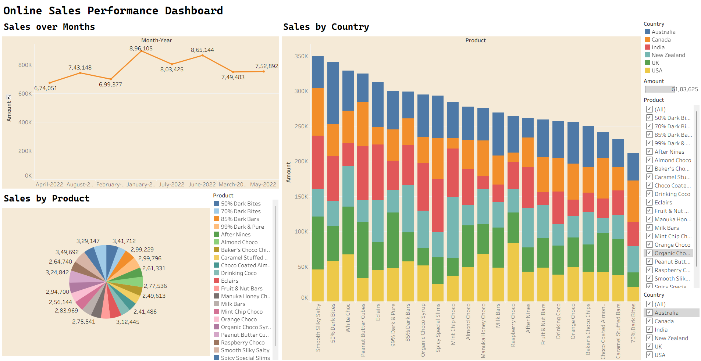

📊 Simple Sales Dashboard – Tableau

📌 Objective
Build an interactive sales dashboard that shows performance by month, country, and product using Tableau.

🛠 Tools Used
Tableau Public/Desktop – Dashboard & Visualizations
CSV Dataset – online_sales_cleaned.csv

📁 Dataset
Columns included:
order_date → Date of order (converted to Month-Year)
country → Region equivalent
product → Product category
amount → Sales amount
boxes_shipped → Quantity shipped

📊 Dashboard Contents
Line Chart – Monthly Sales Trend
Bar Chart – Sales by Country
Pie Chart – Sales by Product
Interactive Filter – Select by Country or Product

🔍 Insights (Sample)
Sales peaked in August 2022, indicating seasonal demand.
India recorded the highest overall sales.
Peanut Butter Cubes contributed the largest share of sales.
Sales in the UK showed steady growth over the year.

✅ Outcome
A clean, interactive Tableau dashboard that provides a quick overview of sales trends, top-performing countries, and product contribution to revenue.

